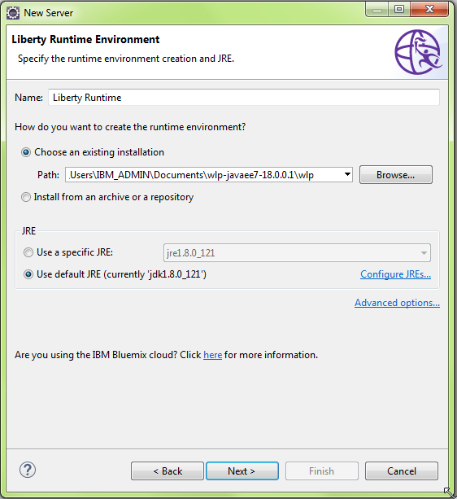

# Java JEE Database example
In this sample we will set up a Java JEE Rest application the resides in Websphere Liberty and interfaces with an IMS DB. 

The rest application will use the IMS Universal Drivers to connect to a IMS database.  The Universal Drivers support both local, type-2, and distributed, type-4, connectivity to a database.  In this example the application will use the type-4 driver to connect to the database over TCP/IP.

See [Distributed and local connectivity with the IMS Universal drivers](https://www.ibm.com/support/knowledgecenter/en/SSEPH2_14.1.0/com.ibm.ims14.doc.apg/ims_odbhowodbworks.htm) for more information.

The needed IMS Universal Drivers for IMS V14 are available through the IMS Java On Demand FMID JMK1406.

This example will use the Insurance database.
 
## Steps:
1. Install WAS Liberty with Java EE 7 Full Platform
1. Install and set up Java 8 JDK
1. Install and set up Eclipse Oxygen
   1. Add Websphere Developer Tools to Eclipse
   1. Add Liberty Server to Eclipse
1. Clone and import the the Java JEE Database example into Eclipse
1. Test the application

## Prerequisites
* [Java 8 JDK](http://www.oracle.com/technetwork/java/javase/downloads/jdk8-downloads-2133151.html)
* [Eclipse IDE for Java EE Developers](http://www.eclipse.org/downloads/eclipse-packages/)
* [WAS Liberty with Java EE 7 Full Platform](https://developer.ibm.com/wasdev/downloads/#asset/runtimes-wlp-javaee7)
* [Universal Drivers Resource Adapters](https://www.ibm.com/support/knowledgecenter/en/SSEPH2_14.1.0/com.ibm.ims14.doc.apg/ims_odbjcatransactionmanagement.htm)

## z/OS Prerequisites
* IMS
* [IMS Catalog](https://www.ibm.com/support/knowledgecenter/en/SSS8QJ_2.2.0/SS6TB2_1.1.0/topics/aty_catalog-overview.htm)
* [Common Service Layer (CSL)](https://www.ibm.com/support/knowledgecenter/en/SSEPH2_14.1.0/com.ibm.ims14.doc.sag/system_intro/ims_csloverview.htm)
* [IMS Connect](https://www.ibm.com/support/knowledgecenter/en/SSEPH2_14.1.0/com.ibm.ims14.doc.ccg/ims_ct_intro.htm)
* [Open Database Manager (ODBM)](https://www.ibm.com/support/knowledgecenter/en/SSEPH2_14.1.0/com.ibm.ims14.doc.sag/system_intro/ims_odbmoverview.htm)

## Install Websphere Liberty Runtime and Java 8 JDK

* Download and install [WAS Liberty with Java EE 7 Full Platform](https://developer.ibm.com/wasdev/downloads/#asset/runtimes-wlp-javaee7)
  * Unzip the archive to a path on the workstation
* Install [Java 8 JDK](http://www.oracle.com/technetwork/java/javase/downloads/jdk8-downloads-2133151.html)
	    
## Install and set up Eclipse Oxygen
### Install Eclipse
* Download and install [Eclipse IDE for Java EE Developers](http://www.eclipse.org/downloads/eclipse-packages/)
* If using the installer you can follow these steps:
  * Select **Eclipse IDE for Java EE Developers** 
  * Select **Install folder**
  * **Accept License**
  * **Launch**
  * Select a directory for the workspace. For example:
     * ` C:\Users\IBM_ADMIN\eclipse-workspace-websphere-jee`
  *  Close the **Welcome** tab to access the workspace
* If downloading the archive file, extract to a location of your choice.
* Double-click the eclipse.exe file to open Eclipse.
  * Select a directory as a workspace

### Set the Eclipse Java JDK
* From the Eclipse menu bar select **Windows -> Preferences -> Java -> Installed JREs**
* **Add**
* **Standard VM** and click **Next**
* Set **JRE Home**
* Browse to Java 8 JDK
* **Finish**
* Under the Name column select the JDK just enabled
* **Apply and close**
					
### Install Websphere Developer Tools (WDT) plugin into Eclipse
* From the Eclipse menu bar select **Help -> Eclipse Marketplace...**
* In the **Find** box type: `WDT` and hit enter.
* Click the **Install** button for **IBM WebSphere Application Server V8.5x Developer Tools**
* **Confirm**
* Check the checkbox to accept the license
* **Finish** 
* **Restart**
* After the restart close the Welcome Overview tab

### Install Liberty Profile server into Eclipse
From the Eclipse menu bar select **Windows -> Preferences -> Server -> Runtime Environments**
* Select **Add**
* Select Liberty Runtime from the IBM folder.
* Select **Browse** to point to the existing Liberty runtime installed earlier.
* The dialog should look something like this screenshot after selecting the server runtime
  
* Click **Next**
* **Finish**
* **Apply and close**

### Clone repository and import into Eclipse
* From the Eclipse menu bar select **Windows -> Show view -> Other -> Git -> Git Repositories**
* From **Git Repositories** view select **Clone a Git reository** and paste the repository URI:
  *  `
  https://github.com/imsdev/ims-java-jee-db.git
  `
* Click **Next**
* **Next**
* **Finish**

To import the Maven project into Eclipse, from the **Git Repositories** view
* Right-click the ims-java-jee-db repository and select **Import Project** and click **Finish**
 * After the project is imported it will take several minutes to load the application, and server.

## Configure the application

Before running the application the server.xml needs to be updated to your IMS specific information. 

### Configure the server.xml for connecting to IMS DB
You will need to point to the z/OS host and IMS DB using the IMS Connect and DRDAPORT information.

The server.xml can be found in the project at `src/main/liberty/config`  Open the file and click the **Source** tab in the Editor window.

### Confiure resourceAdapter

Edit the resourceAdapter tag to point to the location of the rar on your local workstation.

```
<resourceAdapter id="imsudbJXA" location="C:\Users\IBM_ADMIN\Documents\DevOps\rars\v14\imsudbJXA.rar"/>
```

For more information regarding resource adapters see [IMS Universal Database resource adapter](https://www.ibm.com/support/knowledgecenter/en/SSEPH2_14.1.0/com.ibm.ims14.doc.apg/ims_odbjcaintro.htm)

### Configure the connectionFactory properties
* **datastoreServer** - The host name or the IP address of the IMS Connect data store server.
  * This is only specified for type-4 interactions.
* **dataStoreName**
  * This value is speified in the ODBM CSLDCxxx PROCLIB member. 
  * It is the DATASTORE(NAME=name) or DATASTORE(NAME=name, ALIAS(NAME=aliasname)) parameter. If alias is specified in the member you must use the aliasname as the value of the **dataStoreName** property. 
* **portNumber** - port number specified as the DRDAPORT parameter on the ODACCESS statement in the IMS Connect configuration PROCLIB member.  
  * Example ODACCESS statement from an IMS Connect config member:
```
ODACCESS=(ODBMAUTOCONN=Y,IMSPLEX=(MEMBER=IMDOHWS,TMEMBER=PLXDO),
     DRDAPORT=(ID=6695,PORTTMOT=120000),ODBMTMOT=60000)
```
* **databaseName** - the name of the PSB that your application uses to access the target IMS database
* **driverType** - specify as 4 which is used for distributed connectivity

Here is an example connectionFactory elcment:
```
<connectionFactory jndiName="INSURANCEDB" >
   <properties.imsudbJXA datastoreServer="9.30.001.101" portNumber="6695" dataStoreName="DODO" databaseName="INSUR01" 
      driverType="4" />
</connectionFactory>
```

The jndiName attribute of the connectionFactory element is specified in the CustomerInfoService which uses it for executing SQL statements.
```
public class CustomerInfoService {
	@Resource(name="INSURANCEDB")
	DataSource insuranceDB;
```
To look at the complete class source [CustomerInfoService](https://github.com/imsdev/ims-java-jee-db/blob/master/src/main/java/com/ibm/ims/customer/info/CustomerInfoService.java)
For more information [](
https://www.ibm.com/support/knowledgecenter/en/SSEPH2_14.1.0/com.ibm.ims14.doc.apg/ims_odbjdbcdatasrcconn.htm	
)

## Test the application
To test the application start the application by right-clicking the **ims-java-jee-db** project and select **Run as -> Run on Server**.
* Choose **ims-java-jee-db**
* **Next**
* **Finish**

Send a REST http GET message to this destination:
```
http://localhost:9080/ims-java-jee-db/api/customer/info?customerNumber=4
```
* Manage the server from the Servers view in Eclipse by right-clicking the ims-java-jee-db server and selecting the action desired.
